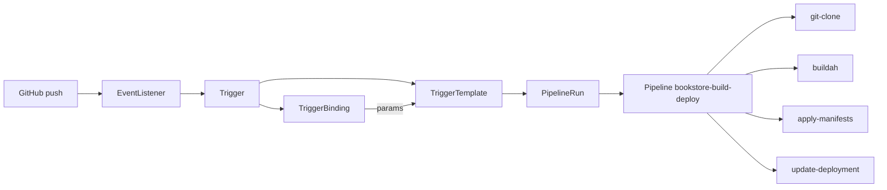

# EX288 Practice Lab: OpenShift Pipelines & Triggers

**Objective:** Fix a Tekton `pipeline.yaml`, run a CI/CD workflow manually, then create Trigger resources so Git push events start the pipeline automatically.

**Estimated time:** 60–75 minutes  
**Exam alignment:** Tekton CRDs (Task, Pipeline, PipelineRun), `tkn` CLI, TriggerBinding, TriggerTemplate, Trigger, EventListener

**Prerequisite:** Complete the Helm lab ([EXERCISE.md](EXERCISE.md)) or at least understand OpenShift projects and `oc`.

---

## Scenario

Your team wants CI/CD for the **bookstore API** in project **`bookstore-cicd`**:

1. Clone application source from Git  
2. Build a container image with **buildah** (cluster task)  
3. Apply Kubernetes manifests from the repo  
4. Patch the Deployment with the new image  
5. Expose an **EventListener** so a GitHub **push** webhook can start the pipeline

You are given starter YAML files with intentional mistakes (`# TODO EX288` comments). Your job is to **adapt** them to meet the requirements below.

---

## Lab prerequisites

On the OpenShift lab system:

- Logged in: `oc login -u developer -p developer` (or your lab credentials)
- **OpenShift Pipelines** operator installed (cluster admin usually does this)
- **Tekton CLI** available: `tkn version`
- Lab copied to `~/ex288-helm-lab`

```bash
cd ~/ex288-helm-lab
chmod +x scripts/*.sh
```

---

## Provided artifacts

```
ex288-helm-lab/
├── EXERCISE-PIPELINES.md          # This file
├── pipelines/
│   ├── pipeline.yaml              # FIX before apply
│   ├── workspace-template.yaml    # For tkn pipeline start
│   ├── tasks/
│   │   ├── apply-manifests.yaml
│   │   └── update-deployment.yaml
│   ├── triggers/
│   │   ├── triggerbinding.yaml    # FIX before apply
│   │   ├── triggertemplate.yaml   # FIX before apply
│   │   ├── trigger.yaml           # FIX before apply
│   │   ├── eventlistener.yaml     # FIX before apply
│   │   └── webhook-payload-sample.json
│   └── app-source/                # Sample app + k8s manifests (push to Git)
└── scripts/
    ├── setup-pipelines-lab.sh
    └── verify-pipelines.sh
```

---

## Task 1 — Create project and verify service account (5 min)

```bash
./scripts/setup-pipelines-lab.sh
oc project bookstore-cicd
oc get sa pipeline
```

**Requirements:**

| Item | Value |
|------|--------|
| Project | `bookstore-cicd` |
| Service account for pipeline runs | `pipeline` |

If `pipeline` SA is missing, ask your instructor. On many clusters it is created automatically when Pipelines is installed.

---

## Task 2 — Install local Tasks (10 min)

Apply the two project-local tasks (deploy steps):

```bash
cd ~/ex288-helm-lab/pipelines
oc apply -f tasks/apply-manifests.yaml
oc apply -f tasks/update-deployment.yaml
tkn task list
```

**Verify:** Both `apply-manifests` and `update-deployment` appear in the list.

Cluster tasks **`git-clone`** and **`buildah`** live in namespace `openshift-pipelines` — you reference them via `taskRef.resolver: cluster` in the pipeline (already in the starter file).

---

## Task 3 — Adapt `pipeline.yaml` (15 min)

Open `pipelines/pipeline.yaml` and fix every `# TODO EX288` item.

### Required pipeline specification

| Requirement | Value |
|-------------|--------|
| Pipeline name | `bookstore-build-deploy` |
| Workspace | `shared-workspace` |
| Task order | `fetch-repository` → `build-image` → `apply-manifests` → `update-deployment` |
| Git clone URL param | Must use `$(params.git-url)` (note the hyphen) |
| `build-image` | Must `runAfter: fetch-repository` |
| `apply-manifests` | Must `runAfter: build-image` |
| `update-deployment` | Already has correct params and `runAfter` |

### Apply and verify

```bash
oc apply -f pipeline.yaml
tkn pipeline describe bookstore-build-deploy
```

Use `tkn pipeline describe` to confirm four tasks and correct `runAfter` chain.

### EX288 tip

Exam tasks often give you a **broken** pipeline YAML. Read `params`, `workspaces`, `taskRef`, and `runAfter` carefully — one wrong field fails the whole run.

---

## Task 4 — Run the pipeline manually (15 min)

You need a Git URL whose repository contains:

- A `Dockerfile` at the repo root  
- A `k8s/` directory with Deployment/Service YAML  

**Option A (recommended):** Push `pipelines/app-source/` to your lab Git server and use that URL.

**Option B:** Use Red Hat’s tutorial repo (different app name — adjust `deployment-name`):

```bash
# Example only — deployment in that repo is pipelines-vote-api, not bookstore-api
GIT_URL=https://github.com/openshift/pipelines-vote-api.git
```

### Start a PipelineRun

Replace `YOUR_GIT_URL` with your actual repository URL:

```bash
cd ~/ex288-helm-lab/pipelines

tkn pipeline start bookstore-build-deploy \
  --serviceaccount pipeline \
  -w name=shared-workspace,volumeClaimTemplateFile=workspace-template.yaml \
  -p deployment-name=bookstore-api \
  -p git-url=YOUR_GIT_URL \
  -p git-revision=main \
  -p IMAGE=image-registry.openshift-image-registry.svc:5000/bookstore-cicd/bookstore-api \
  --showlog
```

### Verify the run

```bash
tkn pipelinerun list
tkn pipelinerun logs <pipelinerun-name> -f   # if --showlog was not used
oc get deploy bookstore-api
oc get pods -l app=bookstore-api
```

**Expected:** PipelineRun status `Succeeded`; Deployment `bookstore-api` exists with your built image.

---

## Task 5 — Create TriggerBinding and TriggerTemplate (10 min)

Fix and apply the trigger starter files.

### TriggerBinding (`triggers/triggerbinding.yaml`)

| Param | Extract from GitHub push payload |
|-------|----------------------------------|
| `git-repo-url` | `$(body.repository.url)` — **not** `html_url` |
| `git-repo-name` | `$(body.repository.name)` |
| `git-revision` | `$(body.head_commit.id)` |

```bash
oc apply -f triggers/triggerbinding.yaml
oc get triggerbinding bookstore-binding -o yaml
```

### TriggerTemplate (`triggers/triggertemplate.yaml`)

| Field | Required value |
|-------|----------------|
| `pipelineRef.name` | `bookstore-build-deploy` |
| `deployment-name` param | `bookstore-api` |
| `IMAGE` param | `image-registry.openshift-image-registry.svc:5000/bookstore-cicd/bookstore-api` |
| `serviceAccountName` | `pipeline` |
| Workspace | `shared-workspace` with 500Mi PVC template |

```bash
oc apply -f triggers/triggertemplate.yaml
```

---

## Task 6 — Create Trigger and EventListener (10 min)

### Trigger (`triggers/trigger.yaml`)

| Field | Required value |
|-------|----------------|
| `bindings[0].ref` | `bookstore-binding` |
| `template.ref` | `bookstore-template` |
| `serviceAccountName` | `pipeline` |

```bash
oc apply -f triggers/trigger.yaml
```

### EventListener (`triggers/eventlistener.yaml`)

| Field | Required value |
|-------|----------------|
| `triggers[0].triggerRef` | `bookstore-trigger` |
| `serviceAccountName` | `pipeline` |

```bash
oc apply -f triggers/eventlistener.yaml
oc get pods -l eventlistener=bookstore-listener
```

Wait until the EventListener pod is **Running**.

### Expose the listener (HTTP — typical in lab)

```bash
oc expose svc el-bookstore-listener
oc get route
```

Note the route host — this is your webhook URL (append `/` or the path your interceptor expects; default listener accepts POST at `/`).

---

## Task 7 — Test the trigger (10 min)

### Simulate a GitHub push (no real GitHub required)

Edit `triggers/webhook-payload-sample.json` so `repository.url` matches **your** Git URL, then:

```bash
ROUTE=$(oc get route el-bookstore-listener -o jsonpath='{.spec.host}')
curl -X POST "http://${ROUTE}" \
  -H "Content-Type: application/json" \
  -H "X-GitHub-Event: push" \
  -d @triggers/webhook-payload-sample.json
```

### Verify a new PipelineRun started

```bash
tkn pipelinerun list
tkn pipelinerun describe <newest-run>
```

**Expected:** A new `bookstore-build-...` PipelineRun appears within seconds.

### Optional: real GitHub webhook

In your fork: **Settings → Webhooks → Add webhook**

- Payload URL: `http://<el-bookstore-listener-route>/`
- Content type: `application/json`
- Events: **Just the push event**

Push a commit to trigger the pipeline.

---

## Task 8 — Self-check (5 min)

```bash
cd ~/ex288-helm-lab
./scripts/verify-pipelines.sh quick
./scripts/verify-pipelines.sh full    # after a successful PipelineRun
```

---

## Grading checklist

| # | Criterion | Done |
|---|-----------|------|
| 1 | Project `bookstore-cicd` exists | ☐ |
| 2 | Tasks `apply-manifests`, `update-deployment` applied | ☐ |
| 3 | Pipeline `bookstore-build-deploy` — correct task order & params | ☐ |
| 4 | Manual `tkn pipeline start` succeeds | ☐ |
| 5 | TriggerBinding extracts `repository.url` | ☐ |
| 6 | TriggerTemplate references correct pipeline & IMAGE | ☐ |
| 7 | Trigger wires binding + template | ☐ |
| 8 | EventListener pod Running + route exposed | ☐ |
| 9 | POST to webhook creates PipelineRun | ☐ |

---

## Troubleshooting

| Symptom | Check |
|---------|--------|
| `pipeline` SA not found | Operator not installed; ask instructor |
| PipelineRun fails at git-clone | Wrong `git-url` param name; URL unreachable from cluster |
| buildah fails | Registry push permissions; IMAGE path must include project name |
| apply-manifests fails | Repo must contain `k8s/` directory |
| update-deployment fails | Deployment name must match manifest (`bookstore-api`) |
| EventListener pod CrashLoop | Wrong `triggerRef` or binding/template refs |
| curl returns 400/500 | Payload JSON invalid; check binding field paths |
| No PipelineRun after webhook | `oc logs` on EventListener pod; verify Trigger → Template → Pipeline name chain |

---

## Clean up

```bash
oc delete project bookstore-cicd
```

---

## Reference: EX288 pipeline & trigger objects



### Useful commands

```bash
tkn pipeline list
tkn pipeline describe bookstore-build-deploy
tkn pipelinerun list
tkn taskrun list
oc get triggerbinding,triggertemplate,trigger,eventlistener
oc logs -l eventlistener=bookstore-listener
```

---

## How this maps to the real EX288 exam

| Exam objective | This lab |
|----------------|----------|
| Work with Tekton CRDs | Tasks, Pipeline, PipelineRun |
| Design CI/CD workflows | git-clone → buildah → deploy |
| Configure pipeline triggers | Binding, Template, Trigger, EventListener |
| Troubleshoot pipelines | Broken starter YAML + verify script |

Good luck — practice fixing YAML under time pressure, then verifying with `tkn` and `oc`.
